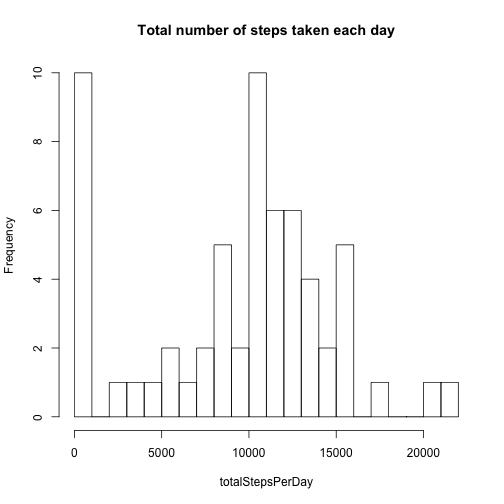

Coursera Reproducible Research Peer Assignment 1
========================================================


### Introduction

This assignment makes use of data from a personal activity monitoring device. This device collects data at 5 minute intervals through out the day. The data consists of two months of data from an anonymous individual collected during the months of October and November, 2012 and include the number of steps taken in 5 minute intervals each day.

### Data 

The variables included in this dataset are:

- steps: Number of steps taking in a 5-minute interval (missing values are coded as NA)

- date: The date on which the measurement was taken in YYYY-MM-DD format

- interval: Identifier for the 5-minute interval in which measurement was taken

### Loading and preprocessing the data

1. Load the data


```r
activity <- read.csv("activity.csv", header=TRUE, na.strings="NA")
```

2. Process/transform the data into a format suitable for your analysis


```r
activity$date <- as.Date(activity$date, "%Y-%m-%d")
```

### What is mean total number of steps taken per day?

For this part of the assignment, you can ignore the missing values in
the dataset.

1. Make a histogram of the total number of steps taken each day


```r
totalStepsPerDay <- tapply(activity$steps, as.factor(activity$date), FUN=sum, na.rm=TRUE)
hist(totalStepsPerDay, breaks=20, main="Total number of steps taken each day")
```

 

2. Calculate and report the **mean** total number of steps taken per day 


```r
meanWithNA <- mean(totalStepsPerDay, na.rm=TRUE)
meanWithNA
```

```
## [1] 9354
```

and **median** total number of steps taken per day


```r
medianWithNA <- median(totalStepsPerDay, na.rm=TRUE)
medianWithNA
```

```
## [1] 10395
```

### What is the average daily activity pattern?

1. Make a time series plot of the 5-minute interval (x-axis) and the average number of steps taken, averaged across all days (y-axis)


```r
meanStepsPerInterval <- aggregate(activity$steps, by=list(activity$interval), FUN=mean, na.rm=TRUE)
colnames(meanStepsPerInterval) <- c("Intervals", "Mean")
plot(meanStepsPerInterval$Intervals, meanStepsPerInterval$Mean, type = "l", main="Time series plot of the 5-minute interval \n and the average number of steps taken")
```

 

2. Which 5-minute interval, on average across all the days in the dataset, contains the maximum number of steps?


```r
meanStepsPerInterval$Intervals[which(meanStepsPerInterval$Mean==max(meanStepsPerInterval$Mean))]
```

```
## [1] 835
```

### Imputing missing values

Note that there are a number of days/intervals where there are missing
values (coded as `NA`). The presence of missing days may introduce
bias into some calculations or summaries of the data.

1. Calculate and report the total number of missing values in the dataset 


```r
stepsNA <- which(is.na(activity$steps))
length(activity$steps[stepsNA])
```

```
## [1] 2304
```

2. Devise a strategy for filling in all of the missing values in the dataset. The strategy does not need to be sophisticated. For example, you could use the mean/median for that day, or the mean for that 5-minute interval, etc.

3. Create a new dataset that is equal to the original dataset but with the missing data filled in.


```r
activityWithoutNA <- read.csv("activity.csv", header=TRUE, na.strings="NA")
activityWithoutNA$date <- as.Date(activityWithoutNA$date, "%Y-%m-%d")

# Observe presence of NAs
summary(activityWithoutNA)
```

```
##      steps            date               interval   
##  Min.   :  0.0   Min.   :2012-10-01   Min.   :   0  
##  1st Qu.:  0.0   1st Qu.:2012-10-16   1st Qu.: 589  
##  Median :  0.0   Median :2012-10-31   Median :1178  
##  Mean   : 37.4   Mean   :2012-10-31   Mean   :1178  
##  3rd Qu.: 12.0   3rd Qu.:2012-11-15   3rd Qu.:1766  
##  Max.   :806.0   Max.   :2012-11-30   Max.   :2355  
##  NA's   :2304
```

```r
# Use the mean of each 5-minute interval across all days to fill in the missing values based on the coresponding interval
for (i in stepsNA) {
    # Using earlier created variables stepsNA and meanStepsPerInterval
    activityWithoutNA$steps[i] <- meanStepsPerInterval$Mean[meanStepsPerInterval$Intervals==activityWithoutNA$interval[i]]   
}

# Observe absence of NAs
summary(activityWithoutNA)
```

```
##      steps            date               interval   
##  Min.   :  0.0   Min.   :2012-10-01   Min.   :   0  
##  1st Qu.:  0.0   1st Qu.:2012-10-16   1st Qu.: 589  
##  Median :  0.0   Median :2012-10-31   Median :1178  
##  Mean   : 37.4   Mean   :2012-10-31   Mean   :1178  
##  3rd Qu.: 27.0   3rd Qu.:2012-11-15   3rd Qu.:1766  
##  Max.   :806.0   Max.   :2012-11-30   Max.   :2355
```

4. Make a histogram of the total number of steps taken each day 


```r
totalStepsPerDayWithoutNA <- tapply(activityWithoutNA$steps, as.factor(activityWithoutNA$date), FUN=sum, na.rm=TRUE)
hist(totalStepsPerDayWithoutNA, breaks=20, main="Total number of steps taken each day")
```

 

and Calculate and report the **mean** total number of steps taken per day


```r
meanWithoutNA <- mean(totalStepsPerDayWithoutNA, na.rm=TRUE)
meanWithoutNA
```

```
## [1] 10766
```

and **median** total number of steps taken per day. 


```r
medianWithoutNA <- median(totalStepsPerDayWithoutNA, na.rm=TRUE)
medianWithoutNA
```

```
## [1] 10766
```

Do these values differ from the estimates from the first part of the assignment? 


```r
# Yes, the means are different
meanWithoutNA-meanWithNA
```

```
## [1] 1412
```

```r
# Yes, the medians are different
medianWithoutNA-medianWithNA
```

```
## [1] 371.2
```

What is the impact of imputing missing data on the estimates of the total daily number of steps?


```r
# The distribution of data changed
par(mfrow=c(1,2))
boxplot(totalStepsPerDay, main="Total Steps Per Day \n in Original Data")
boxplot(totalStepsPerDayWithoutNA, main="Total Steps Per Day in \n New Data Set with NAs being \n Replaced by Interval Means")
```

 

### Are there differences in activity patterns between weekdays and weekends?

Use the dataset with the filled-in missing values for this part.

1. Create a new factor variable in the dataset with two levels -- "weekday" and "weekend" indicating whether a given date is a weekday or weekend day.


```r
activityWithoutNA$weekdayName <- weekdays(activityWithoutNA$date)

for (i in 1:nrow(activityWithoutNA)) {
    activityWithoutNA$weekdayName[i]
    
    if (activityWithoutNA$weekdayName[i]=="Sunday") {
        activityWithoutNA$weekFactor[i] <- "weekend"  
    
    } else if (activityWithoutNA$weekdayName[i]=="Saturday") {
        activityWithoutNA$weekFactor[i] <- "weekend"  
    
    } else {        
        activityWithoutNA$weekFactor[i] <- "weekday"  
    }
    
    activityWithoutNA$weekFactor[i]
}

activityWithoutNA$weekFactor <- as.factor(activityWithoutNA$weekFactor)

summary(activityWithoutNA$weekFactor)
```

```
## weekday weekend 
##   12960    4608
```

2. Make a panel plot containing a time series plot (i.e. `type = "l"`) of the 5-minute interval (x-axis) and the average number of steps taken, averaged across all weekday days or weekend days (y-axis). 


```r
# Weekday subsetting and transformation 
weekdayData <- subset(activityWithoutNA, activityWithoutNA$weekFactor=="weekday")
weekdayMeanStepsPerInterval <- aggregate(weekdayData$steps, by=list(weekdayData$interval), FUN=mean)
colnames(weekdayMeanStepsPerInterval) <- c("Intervals", "Mean")

# Weekend subsetting and transformation 
weekendData <- subset(activityWithoutNA, activityWithoutNA$weekFactor=="weekend")
weekendMeanStepsPerInterval <- aggregate(weekendData$steps, by=list(weekendData$interval), FUN=mean)
colnames(weekendMeanStepsPerInterval) <- c("Intervals", "Mean")

# Plotting
par(mfrow=c(2,1))
plot(weekendMeanStepsPerInterval$Intervals, weekendMeanStepsPerInterval$Mean, type = "l", main="Weekend", xlab="Interval", ylab=" Average Number of Steps")
plot(weekdayMeanStepsPerInterval$Intervals, weekdayMeanStepsPerInterval$Mean, type = "l", main="Weekday", xlab="Interval", ylab=" Average Number of Steps")
```

 
